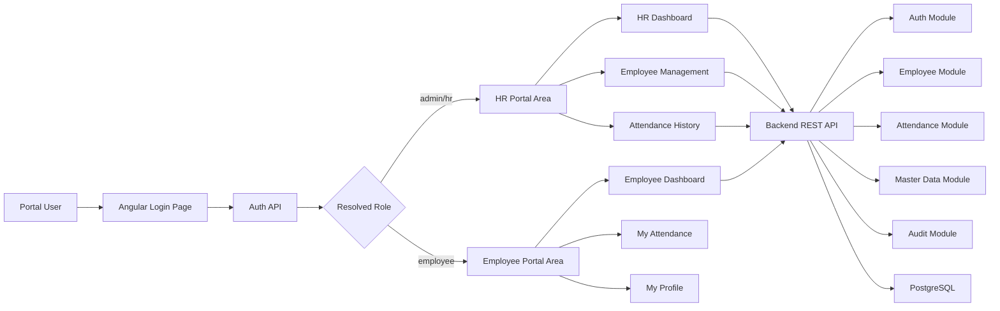
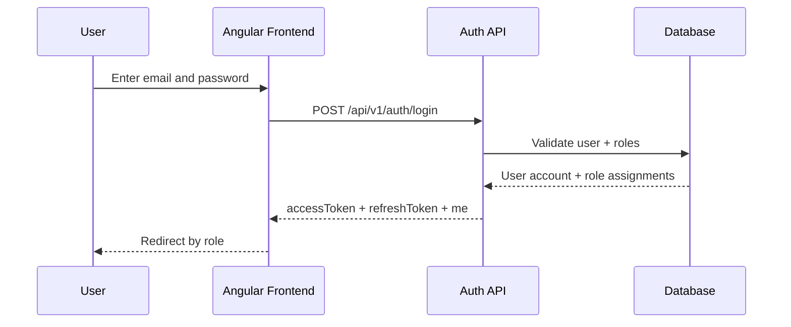
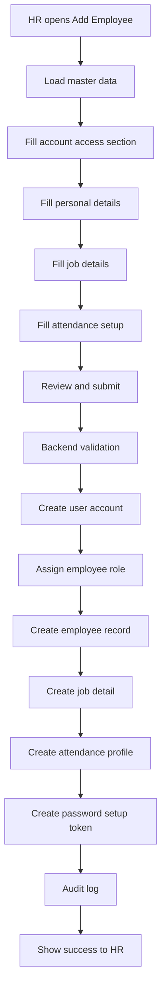
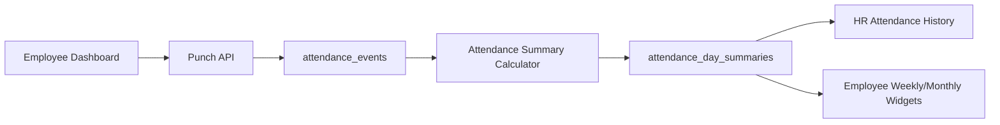
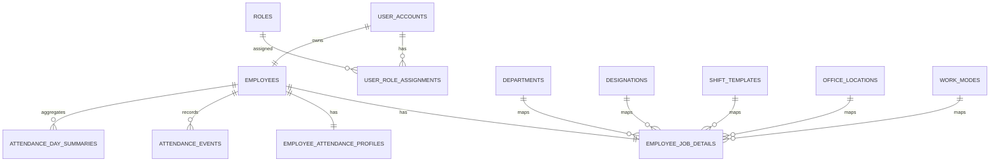

# Phase 1 Implementation Document

## Document Purpose

This document is the developer-ready implementation blueprint for Phase 1 of the Aivan HRMS Portal. It covers:

- a single shared portal for `admin`, `hr`, and `employee`
- HR attendance monitoring
- new employee creation with login/access creation in the same flow
- employee self-service dashboard for today, weekly, monthly attendance, and profile
- frontend and backend architecture
- database design
- API contracts
- delivery plan for frontend and backend developers

This document is the master reference. The detailed implementation appendices are split into:

- [phase1 frontend.md](/Users/vivekmehta/Development/Vivek/AIVan/Aivan-HRMS-Portal/phase1%20frontend.md)
- [phase1 backend.md](/Users/vivekmehta/Development/Vivek/AIVan/Aivan-HRMS-Portal/phase1%20backend.md)

---

## 1. Phase 1 Goal

Build a role-based HRMS portal where:

- `admin` and `hr` can log in to the same portal
- HR can monitor historical attendance for employees
- HR can add a new employee and create employee login access in the same flow
- employees can log in to the same portal and view:
  - today attendance
  - weekly attendance
  - monthly attendance
  - profile summary
  - punch in / punch out actions

---

## 2. Scope

### In Scope

- shared login page for all roles
- JWT/session-based authentication
- role-based route access
- HR dashboard
- employee dashboard
- employee creation wizard with account creation
- attendance event capture
- attendance day summaries
- HR attendance filters and historical views
- seed/master data required for employee creation and attendance reporting

### Out of Scope for Phase 1

- payroll
- leave approval workflows beyond simple placeholders
- project/client billing
- appraisal/performance
- multi-company tenancy
- advanced geofencing
- biometric device integration
- mobile app

---

## 3. Product Roles

### Admin

- full access
- can manage employee records
- can view HR dashboards
- can create employee login accounts

### HR

- can view attendance history for employees in allowed scope
- can add new employee
- can edit employee non-sensitive profile/job records
- can view HR dashboard KPIs

### Employee

- can view only self data
- can punch in / punch out
- can see today, weekly, monthly attendance
- can view profile summary

---

## 4. Role Access Matrix

| Feature | Admin | HR | Employee |
|---|---|---|---|
| Login | Yes | Yes | Yes |
| HR dashboard | Yes | Yes | No |
| Employee list | Yes | Yes | No |
| Add employee | Yes | Yes | No |
| Attendance history of all employees | Yes | Yes | No |
| Own dashboard | Optional | Optional | Yes |
| Own attendance history | Yes | Yes | Yes |
| Punch in/out | Optional | Optional | Yes |

---

## 5. System Architecture

### Recommended Architecture

Use a **modular monolith** for Phase 1:

- Angular frontend in `frontend/`
- Python FastAPI backend in `backend/`
- PostgreSQL database
- REST APIs
- JWT access token authentication

This is the right Phase 1 choice because:

- frontend and backend can move independently
- backend is still empty, so clean module boundaries are easy to enforce now
- Angular routes already exist for login and dashboard screens
- the system is not yet large enough to justify microservices

### High-Level Architecture Diagram

---

## 6. Phase 1 Functional Flow

### 6.1 Login and Role Landing

1. User opens shared login page.
2. User submits email and password.
3. Backend validates credentials and returns JWT plus user profile plus role set.
4. Frontend stores session token.
5. Frontend redirects:
   - `admin` and `hr` -> `/hr/dashboard`
   - `employee` -> `/employee/dashboard`

### Login Flow Diagram

### 6.2 Add New Employee with Login Access

1. HR/Admin opens `Add Employee`.
2. Frontend loads master data:
   - departments
   - designations
   - employment types
   - work modes
   - office locations
   - shift templates
   - holiday calendars
   - weekend policies
   - manager list
3. HR fills wizard sections:
   - account access
   - personal details
   - job details
   - attendance setup
   - review and submit
4. Backend validates:
   - email uniqueness
   - employee code uniqueness
   - mobile number uniqueness if enforced
5. Backend creates all required records in a single transaction:
   - `user_accounts`
   - `user_role_assignments`
   - `employees`
   - `employee_job_details`
   - `employee_attendance_profiles`
   - `password_setup_tokens`
   - `audit_logs`
6. Backend returns success payload.
7. Frontend displays success state and next action.
8. Employee receives setup link or temporary password.

### Employee Creation Flow Diagram

### 6.3 Employee Attendance Use Flow

1. Employee logs into portal.
2. Employee lands on `/employee/dashboard`.
3. Dashboard fetches:
   - today summary
   - weekly summary
   - monthly summary
   - recent attendance history
   - profile snapshot
4. Employee punches in/out.
5. Backend stores raw event in `attendance_events`.
6. Backend updates or rebuilds `attendance_day_summaries`.
7. HR dashboard and attendance history reflect updated data.

### Attendance Data Flow Diagram

---

## 7. Current Frontend Alignment

The following existing frontend assets are already relevant to Phase 1:

- [app.routes.ts](/Users/vivekmehta/Development/Vivek/AIVan/Aivan-HRMS-Portal/frontend/src/app/app.routes.ts)
- [login.html](/Users/vivekmehta/Development/Vivek/AIVan/Aivan-HRMS-Portal/frontend/src/app/features/auth/pages/login/login.html)
- [hr-dashboard.html](/Users/vivekmehta/Development/Vivek/AIVan/Aivan-HRMS-Portal/frontend/src/app/features/hr-dashboard/hr-dashboard.html)
- [emp-dashboard.html](/Users/vivekmehta/Development/Vivek/AIVan/Aivan-HRMS-Portal/frontend/src/app/features/emp-dashboard/emp-dashboard.html)

Phase 1 should **build on these screens**, not throw them away.

Important note:

- [emp-dashboard.html](/Users/vivekmehta/Development/Vivek/AIVan/Aivan-HRMS-Portal/frontend/src/app/features/emp-dashboard/emp-dashboard.html) currently contains unresolved merge conflict markers and must be cleaned before feature integration starts.

---

## 8. Frontend Architecture Summary

### Frontend Objective

Build a role-aware Angular app where:

- auth/session is shared
- route access is protected by role
- HR modules handle attendance history and employee creation
- employee modules handle personal attendance and profile

### Frontend Target Structure Summary

Keep the existing screens, then add:

- core guards
- auth interceptor
- typed models
- feature services
- HR attendance history module
- HR employee management module
- employee profile module

See full exact folder map in [phase1 frontend.md](/Users/vivekmehta/Development/Vivek/AIVan/Aivan-HRMS-Portal/phase1%20frontend.md).

---

## 9. Backend Architecture Summary

### Backend Objective

Build a FastAPI modular backend with these bounded modules:

- `auth`
- `employee`
- `attendance`
- `master-data`
- `dashboard`
- `audit`

### Backend Processing Principles

- all employee creation writes happen inside one database transaction
- attendance raw events are always stored first
- attendance day summaries are derived/updated from raw events
- role enforcement happens server-side on every protected endpoint
- master data is normalized and seeded once

See full exact DB schema and endpoint contracts in [phase1 backend.md](/Users/vivekmehta/Development/Vivek/AIVan/Aivan-HRMS-Portal/phase1%20backend.md).

---

## 10. Database Design Overview

### Core Transaction Tables

- `user_accounts`
- `roles`
- `user_role_assignments`
- `employees`
- `employee_job_details`
- `employee_attendance_profiles`
- `attendance_events`
- `attendance_day_summaries`
- `password_setup_tokens`
- `audit_logs`

### Master Data Tables

- `departments`
- `designations`
- `employment_types`
- `work_modes`
- `office_locations`
- `shift_templates`
- `holiday_calendars`
- `holiday_calendar_days`
- `weekend_policies`
- `weekend_policy_days`
- `attendance_statuses`
- `gender_master`
- `marital_status_master`

### Relationship Overview

---

## 11. API Surface Summary

### Authentication

- `POST /api/v1/auth/login`
- `GET /api/v1/auth/me`
- `POST /api/v1/auth/first-login/set-password`

### Master Data

- `GET /api/v1/master-data/bootstrap`
- `GET /api/v1/master-data/departments`
- `GET /api/v1/master-data/designations`
- `GET /api/v1/master-data/shifts`
- `GET /api/v1/master-data/locations`

### Employee

- `POST /api/v1/employees`
- `GET /api/v1/employees`
- `GET /api/v1/employees/{employee_id}`
- `PATCH /api/v1/employees/{employee_id}`

### Attendance

- `POST /api/v1/attendance/punch`
- `GET /api/v1/attendance/me/today`
- `GET /api/v1/attendance/me/weekly`
- `GET /api/v1/attendance/me/monthly`
- `GET /api/v1/attendance/me/history`
- `GET /api/v1/attendance/hr/history`
- `GET /api/v1/attendance/hr/summary`

Full request and response payloads are defined in [phase1 backend.md](/Users/vivekmehta/Development/Vivek/AIVan/Aivan-HRMS-Portal/phase1%20backend.md).

---

## 12. Master Data Required for Backend

Phase 1 backend must seed the following baseline values.

### Roles

- `admin`
- `hr`
- `employee`

### Departments

- `engineering`
- `human-resources`
- `finance`
- `operations`
- `sales`

### Employment Types

- `full-time`
- `contract`
- `intern`

### Work Modes

- `office`
- `remote`
- `hybrid`

### Attendance Statuses

- `present`
- `absent`
- `half-day`
- `late`
- `week-off`
- `holiday`
- `missing-punch`

### Shift Templates

- `general`
- `morning`
- `evening`

### Marital Status

- `single`
- `married`
- `other`

### Gender

- `male`
- `female`
- `other`

Detailed seed tables and SQL inserts are defined in [phase1 backend.md](/Users/vivekmehta/Development/Vivek/AIVan/Aivan-HRMS-Portal/phase1%20backend.md).

---

## 13. Delivery Ownership

### Frontend Developer Owns

- route architecture
- guards and interceptors
- login integration
- HR dashboard API binding
- employee add wizard UI
- attendance history UI
- employee dashboard UI
- profile UI
- frontend unit tests

### Backend Developer Owns

- FastAPI project structure
- migrations
- auth/JWT
- employee creation transaction
- attendance event storage and summary logic
- master data seeds
- dashboard aggregation queries
- API tests

### Joint Integration Items

- DTO contract alignment
- validation rules
- status naming
- pagination/filter naming
- date/timezone handling
- first-login flow

---

## 14. Recommended Delivery Sequence

### Stage 1: Foundation

- finalize DB schema
- seed master data
- set up backend auth
- add frontend auth guard/interceptor

### Stage 2: Employee Management

- backend employee create API
- frontend employee create wizard
- first-login token creation

### Stage 3: Attendance Core

- backend punch API
- backend day summary calculation
- employee dashboard attendance widgets

### Stage 4: HR Monitoring

- HR attendance history filters
- HR dashboard KPIs
- employee drilldown pages

### Stage 5: Hardening

- validation
- test coverage
- audit logs
- seed demo data

---

## 15. Definition of Done for Phase 1

Phase 1 is complete only when:

- a new employee can be created by HR/Admin with login access in one flow
- employee receives first-login setup path
- employee can log in to the common portal
- employee can punch in/punch out
- employee can see today, weekly, monthly attendance
- HR can filter attendance history by employee/date/department/status
- role-based route and API protections are enforced
- master data is seeded and form dropdowns are driven by APIs

---

## 16. Linked Deliverables

- [phase one.md](/Users/vivekmehta/Development/Vivek/AIVan/Aivan-HRMS-Portal/phase%20one.md)
- [phase1 frontend.md](/Users/vivekmehta/Development/Vivek/AIVan/Aivan-HRMS-Portal/phase1%20frontend.md)
- [phase1 backend.md](/Users/vivekmehta/Development/Vivek/AIVan/Aivan-HRMS-Portal/phase1%20backend.md)

