# Phase 1 Backend Implementation Specification

## 1. Objective

This document defines the backend implementation for Phase 1 of the Aivan HRMS Portal.

Phase 1 backend must support:

- shared login for admin, hr, and employee
- new employee creation with login creation in the same transaction
- historical attendance monitoring for HR
- employee self-service attendance dashboard
- master data driven employee setup

Recommended stack:

- Python
- FastAPI
- SQLAlchemy
- Alembic
- PostgreSQL
- Pydantic
- JWT auth

---

## 2. Backend Folder Map

```text
backend/
└── app/
    ├── main.py
    ├── core/
    │   ├── config.py
    │   ├── database.py
    │   ├── security.py
    │   ├── dependencies.py
    │   └── exceptions.py
    ├── api/
    │   └── v1/
    │       ├── auth_routes.py
    │       ├── employee_routes.py
    │       ├── attendance_routes.py
    │       ├── dashboard_routes.py
    │       └── master_data_routes.py
    ├── models/
    │   ├── base.py
    │   ├── user_account.py
    │   ├── role.py
    │   ├── employee.py
    │   ├── employee_job_detail.py
    │   ├── employee_attendance_profile.py
    │   ├── attendance_event.py
    │   ├── attendance_day_summary.py
    │   ├── password_setup_token.py
    │   ├── audit_log.py
    │   └── master_data.py
    ├── schemas/
    │   ├── auth.py
    │   ├── employee.py
    │   ├── attendance.py
    │   ├── dashboard.py
    │   └── master_data.py
    ├── repositories/
    │   ├── user_repository.py
    │   ├── employee_repository.py
    │   ├── attendance_repository.py
    │   └── master_data_repository.py
    ├── services/
    │   ├── auth_service.py
    │   ├── employee_service.py
    │   ├── attendance_service.py
    │   ├── dashboard_service.py
    │   ├── master_data_service.py
    │   └── audit_service.py
    ├── seeds/
    │   └── phase1_master_data.sql
    └── tests/
        ├── test_auth.py
        ├── test_employee_api.py
        ├── test_attendance_api.py
        └── test_master_data_api.py
```

---

## 3. Domain Modules

### Auth Module

Responsibilities:

- validate credentials
- issue JWT tokens
- return logged-in user profile and roles
- enforce first-login password setup

### Employee Module

Responsibilities:

- create employee
- manage employee profile and job information
- return employee detail for HR and self-service use

### Attendance Module

Responsibilities:

- store punch events
- compute day summaries
- return self and HR attendance views

### Master Data Module

Responsibilities:

- return normalized lookup data
- power all employee creation dropdowns

### Audit Module

Responsibilities:

- log important writes
- support traceability for employee creation and attendance corrections later

---

## 4. Exact Database Schema

### 4.1 PostgreSQL Notes

- use `uuid` primary keys for transactional entities
- use `bigserial` for lookup/master entities
- enable `pgcrypto` for `gen_random_uuid()`

### 4.2 SQL Schema

```sql
CREATE EXTENSION IF NOT EXISTS pgcrypto;

CREATE TABLE roles (
    id BIGSERIAL PRIMARY KEY,
    code VARCHAR(50) NOT NULL UNIQUE,
    name VARCHAR(100) NOT NULL,
    is_active BOOLEAN NOT NULL DEFAULT TRUE,
    created_at TIMESTAMPTZ NOT NULL DEFAULT NOW(),
    updated_at TIMESTAMPTZ NOT NULL DEFAULT NOW()
);

CREATE TABLE departments (
    id BIGSERIAL PRIMARY KEY,
    code VARCHAR(50) NOT NULL UNIQUE,
    name VARCHAR(100) NOT NULL UNIQUE,
    is_active BOOLEAN NOT NULL DEFAULT TRUE,
    created_at TIMESTAMPTZ NOT NULL DEFAULT NOW(),
    updated_at TIMESTAMPTZ NOT NULL DEFAULT NOW()
);

CREATE TABLE designations (
    id BIGSERIAL PRIMARY KEY,
    department_id BIGINT NULL REFERENCES departments(id),
    code VARCHAR(50) NOT NULL UNIQUE,
    name VARCHAR(100) NOT NULL,
    is_active BOOLEAN NOT NULL DEFAULT TRUE,
    created_at TIMESTAMPTZ NOT NULL DEFAULT NOW(),
    updated_at TIMESTAMPTZ NOT NULL DEFAULT NOW()
);

CREATE TABLE employment_types (
    id BIGSERIAL PRIMARY KEY,
    code VARCHAR(50) NOT NULL UNIQUE,
    name VARCHAR(100) NOT NULL UNIQUE,
    is_active BOOLEAN NOT NULL DEFAULT TRUE,
    created_at TIMESTAMPTZ NOT NULL DEFAULT NOW(),
    updated_at TIMESTAMPTZ NOT NULL DEFAULT NOW()
);

CREATE TABLE work_modes (
    id BIGSERIAL PRIMARY KEY,
    code VARCHAR(50) NOT NULL UNIQUE,
    name VARCHAR(100) NOT NULL UNIQUE,
    is_active BOOLEAN NOT NULL DEFAULT TRUE,
    created_at TIMESTAMPTZ NOT NULL DEFAULT NOW(),
    updated_at TIMESTAMPTZ NOT NULL DEFAULT NOW()
);

CREATE TABLE office_locations (
    id BIGSERIAL PRIMARY KEY,
    code VARCHAR(50) NOT NULL UNIQUE,
    name VARCHAR(150) NOT NULL,
    address_line_1 VARCHAR(255) NULL,
    address_line_2 VARCHAR(255) NULL,
    city VARCHAR(100) NULL,
    state VARCHAR(100) NULL,
    country VARCHAR(100) NULL,
    timezone VARCHAR(100) NOT NULL DEFAULT 'Asia/Kolkata',
    is_active BOOLEAN NOT NULL DEFAULT TRUE,
    created_at TIMESTAMPTZ NOT NULL DEFAULT NOW(),
    updated_at TIMESTAMPTZ NOT NULL DEFAULT NOW()
);

CREATE TABLE shift_templates (
    id BIGSERIAL PRIMARY KEY,
    code VARCHAR(50) NOT NULL UNIQUE,
    name VARCHAR(100) NOT NULL,
    start_time TIME NOT NULL,
    end_time TIME NOT NULL,
    grace_minutes SMALLINT NOT NULL DEFAULT 15,
    full_day_minutes INTEGER NOT NULL DEFAULT 480,
    half_day_minutes INTEGER NOT NULL DEFAULT 240,
    is_night_shift BOOLEAN NOT NULL DEFAULT FALSE,
    is_active BOOLEAN NOT NULL DEFAULT TRUE,
    created_at TIMESTAMPTZ NOT NULL DEFAULT NOW(),
    updated_at TIMESTAMPTZ NOT NULL DEFAULT NOW()
);

CREATE TABLE holiday_calendars (
    id BIGSERIAL PRIMARY KEY,
    code VARCHAR(50) NOT NULL UNIQUE,
    name VARCHAR(100) NOT NULL,
    calendar_year INTEGER NOT NULL,
    is_active BOOLEAN NOT NULL DEFAULT TRUE,
    created_at TIMESTAMPTZ NOT NULL DEFAULT NOW(),
    updated_at TIMESTAMPTZ NOT NULL DEFAULT NOW()
);

CREATE TABLE holiday_calendar_days (
    id BIGSERIAL PRIMARY KEY,
    holiday_calendar_id BIGINT NOT NULL REFERENCES holiday_calendars(id) ON DELETE CASCADE,
    holiday_date DATE NOT NULL,
    holiday_name VARCHAR(150) NOT NULL,
    is_optional BOOLEAN NOT NULL DEFAULT FALSE,
    created_at TIMESTAMPTZ NOT NULL DEFAULT NOW(),
    UNIQUE (holiday_calendar_id, holiday_date)
);

CREATE TABLE weekend_policies (
    id BIGSERIAL PRIMARY KEY,
    code VARCHAR(50) NOT NULL UNIQUE,
    name VARCHAR(100) NOT NULL,
    is_active BOOLEAN NOT NULL DEFAULT TRUE,
    created_at TIMESTAMPTZ NOT NULL DEFAULT NOW(),
    updated_at TIMESTAMPTZ NOT NULL DEFAULT NOW()
);

CREATE TABLE weekend_policy_days (
    id BIGSERIAL PRIMARY KEY,
    weekend_policy_id BIGINT NOT NULL REFERENCES weekend_policies(id) ON DELETE CASCADE,
    weekday SMALLINT NOT NULL CHECK (weekday BETWEEN 0 AND 6),
    UNIQUE (weekend_policy_id, weekday)
);

CREATE TABLE attendance_statuses (
    id BIGSERIAL PRIMARY KEY,
    code VARCHAR(50) NOT NULL UNIQUE,
    name VARCHAR(100) NOT NULL,
    sort_order SMALLINT NOT NULL DEFAULT 0,
    is_active BOOLEAN NOT NULL DEFAULT TRUE,
    created_at TIMESTAMPTZ NOT NULL DEFAULT NOW(),
    updated_at TIMESTAMPTZ NOT NULL DEFAULT NOW()
);

CREATE TABLE gender_master (
    id BIGSERIAL PRIMARY KEY,
    code VARCHAR(50) NOT NULL UNIQUE,
    name VARCHAR(100) NOT NULL,
    is_active BOOLEAN NOT NULL DEFAULT TRUE
);

CREATE TABLE marital_status_master (
    id BIGSERIAL PRIMARY KEY,
    code VARCHAR(50) NOT NULL UNIQUE,
    name VARCHAR(100) NOT NULL,
    is_active BOOLEAN NOT NULL DEFAULT TRUE
);

CREATE TABLE user_accounts (
    id UUID PRIMARY KEY DEFAULT gen_random_uuid(),
    email VARCHAR(255) NOT NULL UNIQUE,
    username VARCHAR(255) NULL UNIQUE,
    password_hash TEXT NOT NULL,
    account_status VARCHAR(30) NOT NULL CHECK (account_status IN ('invited', 'active', 'suspended', 'inactive')),
    first_login_required BOOLEAN NOT NULL DEFAULT TRUE,
    last_login_at TIMESTAMPTZ NULL,
    created_at TIMESTAMPTZ NOT NULL DEFAULT NOW(),
    updated_at TIMESTAMPTZ NOT NULL DEFAULT NOW()
);

CREATE TABLE user_role_assignments (
    id UUID PRIMARY KEY DEFAULT gen_random_uuid(),
    user_account_id UUID NOT NULL REFERENCES user_accounts(id) ON DELETE CASCADE,
    role_id BIGINT NOT NULL REFERENCES roles(id),
    is_primary BOOLEAN NOT NULL DEFAULT FALSE,
    is_active BOOLEAN NOT NULL DEFAULT TRUE,
    created_at TIMESTAMPTZ NOT NULL DEFAULT NOW(),
    UNIQUE (user_account_id, role_id)
);

CREATE TABLE employees (
    id UUID PRIMARY KEY DEFAULT gen_random_uuid(),
    user_account_id UUID NOT NULL UNIQUE REFERENCES user_accounts(id) ON DELETE CASCADE,
    employee_code VARCHAR(50) NOT NULL UNIQUE,
    first_name VARCHAR(100) NOT NULL,
    last_name VARCHAR(100) NOT NULL,
    official_email VARCHAR(255) NOT NULL UNIQUE,
    personal_email VARCHAR(255) NULL,
    phone VARCHAR(30) NOT NULL UNIQUE,
    emergency_contact_name VARCHAR(150) NULL,
    emergency_contact_phone VARCHAR(30) NULL,
    date_of_birth DATE NULL,
    gender_id BIGINT NULL REFERENCES gender_master(id),
    marital_status_id BIGINT NULL REFERENCES marital_status_master(id),
    employment_status VARCHAR(30) NOT NULL DEFAULT 'active' CHECK (employment_status IN ('active', 'inactive', 'probation', 'separated')),
    created_at TIMESTAMPTZ NOT NULL DEFAULT NOW(),
    updated_at TIMESTAMPTZ NOT NULL DEFAULT NOW()
);

CREATE TABLE employee_job_details (
    employee_id UUID PRIMARY KEY REFERENCES employees(id) ON DELETE CASCADE,
    department_id BIGINT NOT NULL REFERENCES departments(id),
    designation_id BIGINT NOT NULL REFERENCES designations(id),
    employment_type_id BIGINT NOT NULL REFERENCES employment_types(id),
    work_mode_id BIGINT NOT NULL REFERENCES work_modes(id),
    office_location_id BIGINT NOT NULL REFERENCES office_locations(id),
    shift_template_id BIGINT NOT NULL REFERENCES shift_templates(id),
    holiday_calendar_id BIGINT NOT NULL REFERENCES holiday_calendars(id),
    weekend_policy_id BIGINT NOT NULL REFERENCES weekend_policies(id),
    manager_employee_id UUID NULL REFERENCES employees(id),
    joining_date DATE NOT NULL,
    probation_end_date DATE NULL,
    created_at TIMESTAMPTZ NOT NULL DEFAULT NOW(),
    updated_at TIMESTAMPTZ NOT NULL DEFAULT NOW()
);

CREATE TABLE employee_attendance_profiles (
    employee_id UUID PRIMARY KEY REFERENCES employees(id) ON DELETE CASCADE,
    attendance_enabled BOOLEAN NOT NULL DEFAULT TRUE,
    allow_web_punch BOOLEAN NOT NULL DEFAULT TRUE,
    timezone VARCHAR(100) NOT NULL DEFAULT 'Asia/Kolkata',
    grace_minutes_override SMALLINT NULL,
    created_at TIMESTAMPTZ NOT NULL DEFAULT NOW(),
    updated_at TIMESTAMPTZ NOT NULL DEFAULT NOW()
);

CREATE TABLE attendance_events (
    id UUID PRIMARY KEY DEFAULT gen_random_uuid(),
    employee_id UUID NOT NULL REFERENCES employees(id) ON DELETE CASCADE,
    event_timestamp TIMESTAMPTZ NOT NULL,
    event_local_date DATE NOT NULL,
    direction VARCHAR(10) NOT NULL CHECK (direction IN ('in', 'out')),
    source VARCHAR(30) NOT NULL CHECK (source IN ('web', 'admin')),
    work_mode_id BIGINT NULL REFERENCES work_modes(id),
    office_location_id BIGINT NULL REFERENCES office_locations(id),
    remarks TEXT NULL,
    created_by_user_id UUID NULL REFERENCES user_accounts(id),
    created_at TIMESTAMPTZ NOT NULL DEFAULT NOW()
);

CREATE TABLE attendance_day_summaries (
    id UUID PRIMARY KEY DEFAULT gen_random_uuid(),
    employee_id UUID NOT NULL REFERENCES employees(id) ON DELETE CASCADE,
    attendance_date DATE NOT NULL,
    first_in TIMESTAMPTZ NULL,
    last_out TIMESTAMPTZ NULL,
    total_work_minutes INTEGER NOT NULL DEFAULT 0,
    total_break_minutes INTEGER NOT NULL DEFAULT 0,
    overtime_minutes INTEGER NOT NULL DEFAULT 0,
    attendance_status_id BIGINT NOT NULL REFERENCES attendance_statuses(id),
    is_late BOOLEAN NOT NULL DEFAULT FALSE,
    is_missing_punch BOOLEAN NOT NULL DEFAULT FALSE,
    source_version INTEGER NOT NULL DEFAULT 1,
    created_at TIMESTAMPTZ NOT NULL DEFAULT NOW(),
    updated_at TIMESTAMPTZ NOT NULL DEFAULT NOW(),
    UNIQUE (employee_id, attendance_date)
);

CREATE TABLE password_setup_tokens (
    id UUID PRIMARY KEY DEFAULT gen_random_uuid(),
    user_account_id UUID NOT NULL REFERENCES user_accounts(id) ON DELETE CASCADE,
    token_hash TEXT NOT NULL,
    expires_at TIMESTAMPTZ NOT NULL,
    used_at TIMESTAMPTZ NULL,
    created_at TIMESTAMPTZ NOT NULL DEFAULT NOW()
);

CREATE TABLE audit_logs (
    id BIGSERIAL PRIMARY KEY,
    actor_user_id UUID NULL REFERENCES user_accounts(id),
    entity_type VARCHAR(50) NOT NULL,
    entity_id UUID NULL,
    action VARCHAR(100) NOT NULL,
    before_json JSONB NULL,
    after_json JSONB NULL,
    created_at TIMESTAMPTZ NOT NULL DEFAULT NOW()
);

CREATE INDEX idx_employees_full_name
ON employees (first_name, last_name);

CREATE INDEX idx_employee_job_details_department
ON employee_job_details (department_id);

CREATE INDEX idx_attendance_events_employee_date
ON attendance_events (employee_id, event_local_date);

CREATE INDEX idx_attendance_day_summaries_employee_date
ON attendance_day_summaries (employee_id, attendance_date);
```

---

## 5. Phase 1 Master Data Seeds

### roles

```sql
INSERT INTO roles (code, name) VALUES
('admin', 'Admin'),
('hr', 'HR'),
('employee', 'Employee');
```

### departments

```sql
INSERT INTO departments (code, name) VALUES
('engineering', 'Engineering'),
('human-resources', 'Human Resources'),
('finance', 'Finance'),
('operations', 'Operations'),
('sales', 'Sales');
```

### designations

```sql
INSERT INTO designations (department_id, code, name)
SELECT d.id, x.code, x.name
FROM departments d
JOIN (
    VALUES
    ('engineering', 'software-engineer', 'Software Engineer'),
    ('engineering', 'senior-software-engineer', 'Senior Software Engineer'),
    ('human-resources', 'hr-executive', 'HR Executive'),
    ('human-resources', 'hr-manager', 'HR Manager'),
    ('operations', 'operations-executive', 'Operations Executive')
) AS x(department_code, code, name)
ON d.code = x.department_code;
```

### employment_types

```sql
INSERT INTO employment_types (code, name) VALUES
('full-time', 'Full Time'),
('contract', 'Contract'),
('intern', 'Intern');
```

### work_modes

```sql
INSERT INTO work_modes (code, name) VALUES
('office', 'Office'),
('remote', 'Remote'),
('hybrid', 'Hybrid');
```

### shift_templates

```sql
INSERT INTO shift_templates
(code, name, start_time, end_time, grace_minutes, full_day_minutes, half_day_minutes, is_night_shift)
VALUES
('general', 'General Shift', '09:30', '18:30', 15, 480, 240, FALSE),
('morning', 'Morning Shift', '07:00', '16:00', 10, 480, 240, FALSE),
('evening', 'Evening Shift', '13:00', '22:00', 10, 480, 240, FALSE);
```

### office_locations

```sql
INSERT INTO office_locations
(code, name, address_line_1, city, state, country, timezone)
VALUES
('hq-indore', 'Indore HQ', 'Vijay Nagar', 'Indore', 'Madhya Pradesh', 'India', 'Asia/Kolkata'),
('blr-office', 'Bangalore Office', 'Outer Ring Road', 'Bangalore', 'Karnataka', 'India', 'Asia/Kolkata');
```

### holiday_calendars

```sql
INSERT INTO holiday_calendars (code, name, calendar_year)
VALUES ('india-2026', 'India Holiday Calendar 2026', 2026);
```

### weekend_policies

```sql
INSERT INTO weekend_policies (code, name)
VALUES ('sat-sun', 'Saturday and Sunday');
```

### weekend_policy_days

```sql
INSERT INTO weekend_policy_days (weekend_policy_id, weekday)
SELECT id, x.weekday
FROM weekend_policies
JOIN (VALUES (0), (6)) AS x(weekday) ON weekend_policies.code = 'sat-sun';
```

### attendance_statuses

```sql
INSERT INTO attendance_statuses (code, name, sort_order) VALUES
('present', 'Present', 1),
('late', 'Late', 2),
('half-day', 'Half Day', 3),
('absent', 'Absent', 4),
('week-off', 'Week Off', 5),
('holiday', 'Holiday', 6),
('missing-punch', 'Missing Punch', 7);
```

### gender_master

```sql
INSERT INTO gender_master (code, name) VALUES
('male', 'Male'),
('female', 'Female'),
('other', 'Other');
```

### marital_status_master

```sql
INSERT INTO marital_status_master (code, name) VALUES
('single', 'Single'),
('married', 'Married'),
('other', 'Other');
```

---

## 6. API Contracts

All Phase 1 APIs should be under `/api/v1`.

## 6.1 POST /api/v1/auth/login

### Request

```json
{
  "email": "ananya.sharma@aivan.com",
  "password": "StrongPassword123"
}
```

### Success Response

```json
{
  "accessToken": "jwt-access-token",
  "refreshToken": "jwt-refresh-token",
  "tokenType": "bearer",
  "expiresIn": 3600,
  "me": {
    "id": "7eb87695-df52-4df1-bffe-4e260c2822b8",
    "employeeId": "e13063ef-1672-4e38-b20e-f6b93be1d9ff",
    "fullName": "Ananya Sharma",
    "email": "ananya.sharma@aivan.com",
    "roles": ["employee"],
    "primaryRole": "employee",
    "firstLoginRequired": false
  }
}
```

### Error Response

```json
{
  "message": "Invalid email or password",
  "code": "INVALID_CREDENTIALS"
}
```

## 6.2 GET /api/v1/auth/me

### Success Response

```json
{
  "id": "7eb87695-df52-4df1-bffe-4e260c2822b8",
  "employeeId": "e13063ef-1672-4e38-b20e-f6b93be1d9ff",
  "fullName": "Ananya Sharma",
  "email": "ananya.sharma@aivan.com",
  "roles": ["employee"],
  "primaryRole": "employee",
  "firstLoginRequired": false
}
```

## 6.3 POST /api/v1/auth/first-login/set-password

### Request

```json
{
  "token": "password-setup-token-from-email",
  "newPassword": "StrongPassword123",
  "confirmPassword": "StrongPassword123"
}
```

### Success Response

```json
{
  "message": "Password set successfully",
  "accountStatus": "active"
}
```

## 6.4 GET /api/v1/master-data/bootstrap

### Purpose

Return all initial dropdown data needed by `Add Employee`.

### Success Response

```json
{
  "departments": [
    { "id": 1, "code": "engineering", "name": "Engineering" }
  ],
  "designations": [
    { "id": 1, "code": "software-engineer", "name": "Software Engineer", "departmentId": 1 }
  ],
  "employmentTypes": [
    { "id": 1, "code": "full-time", "name": "Full Time" }
  ],
  "workModes": [
    { "id": 1, "code": "office", "name": "Office" }
  ],
  "officeLocations": [
    { "id": 1, "code": "hq-indore", "name": "Indore HQ", "timezone": "Asia/Kolkata" }
  ],
  "shiftTemplates": [
    {
      "id": 1,
      "code": "general",
      "name": "General Shift",
      "startTime": "09:30:00",
      "endTime": "18:30:00",
      "graceMinutes": 15
    }
  ],
  "holidayCalendars": [
    { "id": 1, "code": "india-2026", "name": "India Holiday Calendar 2026" }
  ],
  "weekendPolicies": [
    { "id": 1, "code": "sat-sun", "name": "Saturday and Sunday" }
  ],
  "genders": [
    { "id": 1, "code": "male", "name": "Male" }
  ],
  "managers": [
    { "employeeId": "uuid", "employeeCode": "EMP001", "fullName": "Ravi Kumar" }
  ]
}
```

## 6.5 POST /api/v1/employees

### Request

```json
{
  "account": {
    "officialEmail": "ananya.sharma@aivan.com",
    "loginEmail": "ananya.sharma@aivan.com",
    "roleCode": "employee",
    "passwordSetupMode": "setup_link",
    "temporaryPassword": null
  },
  "personal": {
    "firstName": "Ananya",
    "lastName": "Sharma",
    "phone": "9876543210",
    "dateOfBirth": "1998-06-15",
    "genderCode": "female",
    "personalEmail": "ananya.personal@gmail.com",
    "emergencyContactName": "Rakesh Sharma",
    "emergencyContactPhone": "9876500000"
  },
  "job": {
    "employeeCode": "EMP0024",
    "departmentId": 1,
    "designationId": 1,
    "employmentTypeId": 1,
    "workModeId": 1,
    "officeLocationId": 1,
    "shiftTemplateId": 1,
    "holidayCalendarId": 1,
    "weekendPolicyId": 1,
    "managerEmployeeId": "49e48738-4f47-4ff9-b799-3b9f8e39fc70",
    "joiningDate": "2026-04-15"
  },
  "attendanceProfile": {
    "allowWebPunch": true,
    "timezone": "Asia/Kolkata",
    "graceMinutesOverride": null
  }
}
```

### Success Response

```json
{
  "employeeId": "e13063ef-1672-4e38-b20e-f6b93be1d9ff",
  "userId": "7eb87695-df52-4df1-bffe-4e260c2822b8",
  "employeeCode": "EMP0024",
  "accountStatus": "invited",
  "firstLoginRequired": true,
  "passwordSetupMode": "setup_link",
  "message": "Employee created successfully"
}
```

### Validation Error Response

```json
{
  "message": "Validation failed",
  "code": "VALIDATION_ERROR",
  "errors": {
    "account.loginEmail": ["Email already exists"],
    "job.employeeCode": ["Employee code already exists"]
  }
}
```

## 6.6 GET /api/v1/employees

### Example Query Params

`?search=ananya&departmentId=1&page=1&pageSize=20`

### Success Response

```json
{
  "items": [
    {
      "employeeId": "e13063ef-1672-4e38-b20e-f6b93be1d9ff",
      "employeeCode": "EMP0024",
      "fullName": "Ananya Sharma",
      "departmentName": "Engineering",
      "designationName": "Software Engineer",
      "workModeName": "Office",
      "employmentStatus": "active",
      "officialEmail": "ananya.sharma@aivan.com"
    }
  ],
  "page": 1,
  "pageSize": 20,
  "total": 1
}
```

## 6.7 GET /api/v1/employees/{employee_id}

### Success Response

```json
{
  "employeeId": "e13063ef-1672-4e38-b20e-f6b93be1d9ff",
  "employeeCode": "EMP0024",
  "firstName": "Ananya",
  "lastName": "Sharma",
  "fullName": "Ananya Sharma",
  "officialEmail": "ananya.sharma@aivan.com",
  "personalEmail": "ananya.personal@gmail.com",
  "phone": "9876543210",
  "department": { "id": 1, "name": "Engineering" },
  "designation": { "id": 1, "name": "Software Engineer" },
  "manager": { "employeeId": "49e48738-4f47-4ff9-b799-3b9f8e39fc70", "fullName": "Ravi Kumar" },
  "shiftTemplate": { "id": 1, "name": "General Shift" },
  "officeLocation": { "id": 1, "name": "Indore HQ" },
  "workMode": { "id": 1, "name": "Office" },
  "joiningDate": "2026-04-15",
  "employmentStatus": "active"
}
```

## 6.8 POST /api/v1/attendance/punch

### Request

```json
{
  "direction": "in",
  "source": "web",
  "workModeCode": "office",
  "officeLocationId": 1,
  "remarks": "Reached office"
}
```

### Success Response

```json
{
  "eventId": "8f1a2f4d-0982-4963-8cf2-4fc5c9c7b54c",
  "attendanceDate": "2026-04-10",
  "latestDirection": "in",
  "firstIn": "2026-04-10T09:31:02+05:30",
  "lastOut": null,
  "statusCode": "present",
  "message": "Punch recorded"
}
```

## 6.9 GET /api/v1/attendance/me/today

### Success Response

```json
{
  "attendanceDate": "2026-04-10",
  "firstIn": "2026-04-10T09:31:02+05:30",
  "lastOut": null,
  "statusCode": "present",
  "totalWorkMinutes": 245,
  "totalBreakMinutes": 15,
  "overtimeMinutes": 0,
  "latestDirection": "in"
}
```

## 6.10 GET /api/v1/attendance/me/weekly

### Success Response

```json
{
  "weekStart": "2026-04-06",
  "weekEnd": "2026-04-12",
  "presentDays": 5,
  "absentDays": 0,
  "lateDays": 1,
  "totalWorkMinutes": 2310,
  "items": [
    {
      "attendanceDate": "2026-04-10",
      "statusCode": "present",
      "totalWorkMinutes": 480
    }
  ]
}
```

## 6.11 GET /api/v1/attendance/me/monthly

### Success Response

```json
{
  "month": "2026-04",
  "presentDays": 8,
  "absentDays": 0,
  "lateDays": 1,
  "totalWorkMinutes": 3840,
  "workingDays": 22,
  "items": [
    {
      "attendanceDate": "2026-04-10",
      "statusCode": "present",
      "firstIn": "2026-04-10T09:31:02+05:30",
      "lastOut": "2026-04-10T18:42:10+05:30"
    }
  ]
}
```

## 6.12 GET /api/v1/attendance/me/history

### Example Query Params

`?dateFrom=2026-04-01&dateTo=2026-04-30&page=1&pageSize=31`

### Success Response

```json
{
  "items": [
    {
      "attendanceDate": "2026-04-10",
      "dayName": "Friday",
      "firstIn": "09:31",
      "lastOut": "18:42",
      "totalWorkMinutes": 480,
      "totalBreakMinutes": 15,
      "overtimeMinutes": 12,
      "statusCode": "present"
    }
  ],
  "page": 1,
  "pageSize": 31,
  "total": 10
}
```

## 6.13 GET /api/v1/attendance/hr/history

### Example Query Params

`?dateFrom=2026-04-01&dateTo=2026-04-30&departmentId=1&statusCode=present&page=1&pageSize=50`

### Success Response

```json
{
  "items": [
    {
      "employeeId": "e13063ef-1672-4e38-b20e-f6b93be1d9ff",
      "employeeCode": "EMP0024",
      "employeeName": "Ananya Sharma",
      "departmentName": "Engineering",
      "attendanceDate": "2026-04-10",
      "firstIn": "09:31",
      "lastOut": "18:42",
      "totalWorkMinutes": 480,
      "overtimeMinutes": 12,
      "statusCode": "present",
      "workModeCode": "office"
    }
  ],
  "page": 1,
  "pageSize": 50,
  "total": 1
}
```

## 6.14 GET /api/v1/attendance/hr/summary

### Success Response

```json
{
  "date": "2026-04-10",
  "totalEmployees": 23,
  "presentEmployees": 19,
  "absentEmployees": 2,
  "lateEmployees": 2,
  "missingPunchEmployees": 1,
  "workModeBreakdown": [
    { "code": "office", "count": 12 },
    { "code": "remote", "count": 7 },
    { "code": "hybrid", "count": 4 }
  ],
  "genderBreakdown": [
    { "code": "male", "count": 10 },
    { "code": "female", "count": 13 }
  ],
  "recentEntries": [
    {
      "employeeName": "Ananya Sharma",
      "attendanceDate": "2026-04-10",
      "firstIn": "09:31",
      "lastOut": "18:42",
      "statusCode": "present"
    }
  ]
}
```

---

## 7. Backend Business Rules

### Employee Creation

- `account.loginEmail` must be unique in `user_accounts.email`
- `account.officialEmail` must match company mail format if policy is enabled
- `job.employeeCode` must be unique
- role for Phase 1 employee creation is always `employee`
- all inserts happen in one DB transaction
- if any insert fails, rollback all prior inserts

### Attendance

- employee can only punch self
- HR cannot punch for employee in Phase 1 unless future admin correction API is added
- punch direction must alternate logically where possible
- summary is recalculated after every punch write
- holiday and week-off can override final summary status

### Authorization

- only `admin` and `hr` can call `/employees`, `/attendance/hr/*`
- `employee` can call only `/attendance/me/*`
- `/employees/{employee_id}` can be accessed by self or HR/Admin

---

## 8. Service Responsibilities

### auth_service.py

- verify password
- issue token
- decode current user
- manage first-login password change

### employee_service.py

- validate create payload
- resolve master data references
- create user account
- assign employee role
- create employee
- create job details
- create attendance profile
- create password setup token
- write audit log

### attendance_service.py

- create punch event
- fetch employee attendance data
- compute day summary
- fetch HR filtered history
- fetch dashboard aggregates

### master_data_service.py

- list dropdown entities
- provide bootstrap payload

### audit_service.py

- central write helper for audit events

---

## 9. Transaction Flow for Employee Creation

```mermaid
sequenceDiagram
    participant HR as HR/Admin
    participant API as Employee API
    participant SVC as EmployeeService
    participant DB as PostgreSQL

    HR->>API: POST /employees
    API->>SVC: validate and create
    SVC->>DB: validate unique email/code
    SVC->>DB: insert user_accounts
    SVC->>DB: insert user_role_assignments
    SVC->>DB: insert employees
    SVC->>DB: insert employee_job_details
    SVC->>DB: insert employee_attendance_profiles
    SVC->>DB: insert password_setup_tokens
    SVC->>DB: insert audit_logs
    DB-->>SVC: commit
    SVC-->>API: success payload
    API-->>HR: employee created
```



Pseudo-order inside service:

1. open DB transaction
2. validate master data FK references
3. validate unique login email
4. validate unique official email
5. validate unique employee code
6. hash temporary password or generate placeholder password
7. create `user_accounts`
8. assign `employee` role
9. create `employees`
10. create `employee_job_details`
11. create `employee_attendance_profiles`
12. generate setup token if `setup_link`
13. write `audit_logs`
14. commit

---

## 10. Attendance Summary Rules

### Input

- ordered `attendance_events` for one employee and one date

### Output

- `first_in`
- `last_out`
- `total_work_minutes`
- `total_break_minutes`
- `overtime_minutes`
- `attendance_status_id`
- `is_late`
- `is_missing_punch`

### Recommended Algorithm

1. load employee shift template for target date
2. load raw events ordered by timestamp
3. pair `in` and `out` records sequentially
4. accumulate worked minutes
5. detect unmatched `in` or `out` -> `is_missing_punch = true`
6. compare `first_in` with shift start + grace
7. determine overtime if `total_work_minutes > full_day_minutes`
8. pick status in priority order:
   - holiday
   - week-off
   - missing-punch
   - absent
   - half-day
   - late
   - present

---

## 11. Backend Validation and Error Codes

### Suggested Error Codes

- `INVALID_CREDENTIALS`
- `ACCOUNT_INACTIVE`
- `FIRST_LOGIN_REQUIRED`
- `VALIDATION_ERROR`
- `DUPLICATE_EMAIL`
- `DUPLICATE_EMPLOYEE_CODE`
- `MASTER_DATA_NOT_FOUND`
- `FORBIDDEN`
- `ATTENDANCE_PUNCH_INVALID`
- `ATTENDANCE_SUMMARY_REBUILD_FAILED`

### Error Shape

```json
{
  "message": "Validation failed",
  "code": "VALIDATION_ERROR",
  "errors": {
    "job.employeeCode": ["Employee code already exists"]
  }
}
```

---

## 12. Security Rules

- bcrypt or argon2 for password hashing
- JWT access token expiration 1 hour
- refresh token support optional in Phase 1, but recommended
- first login token expiry 24 hours
- all protected routes require bearer token
- role checks must happen in backend dependencies
- audit every employee create action

---

## 13. Backend Testing Plan

### Unit Tests

- password verification
- token generation/validation
- employee creation validator
- attendance pairing calculator
- status resolution rules

### API Tests

- login success/failure
- master data bootstrap
- employee create success
- employee create duplicate email
- employee create duplicate employee code
- self attendance today
- HR attendance history authorization
- employee unauthorized access to HR routes

### Database Tests

- transaction rollback on partial create failure
- unique constraints
- summary upsert behavior

---

## 14. Backend Developer Task Breakdown

### Task Group A: Project Bootstrap

1. Create FastAPI application structure.
2. Create DB connection setup.
3. Add Alembic.
4. Add env config handling.

### Task Group B: Core Auth

1. Create `user_accounts` model and migration.
2. Create `roles` and `user_role_assignments`.
3. Seed base roles.
4. Implement password hashing.
5. Implement login endpoint.
6. Implement `me` endpoint.
7. Implement role dependency helpers.

### Task Group C: Master Data

1. Create all master tables.
2. Add seed script `phase1_master_data.sql`.
3. Add bootstrap endpoint.

### Task Group D: Employee Module

1. Create `employees` table and migration.
2. Create `employee_job_details` table and migration.
3. Create `employee_attendance_profiles` table and migration.
4. Implement create employee service transaction.
5. Implement create employee API.
6. Implement employee list/detail APIs.

### Task Group E: First Login Flow

1. Create `password_setup_tokens` table.
2. Implement setup token generator and validator.
3. Implement `first-login/set-password` API.

### Task Group F: Attendance Module

1. Create `attendance_events` table.
2. Create `attendance_day_summaries` table.
3. Implement punch endpoint.
4. Implement summary rebuild logic.
5. Implement self attendance APIs.
6. Implement HR attendance history and summary APIs.

### Task Group G: Audit and Hardening

1. Create `audit_logs` table.
2. Log employee creation.
3. Add API tests.
4. Add transaction rollback tests.

---

## 15. Backend-Frontend Contract Freeze Checklist

These must be agreed before parallel implementation moves too far:

- login response shape
- `me` response shape
- bootstrap master data shape
- create employee request/response
- HR attendance history query param names
- pagination response structure
- attendance status codes
- date string format
- timezone assumptions

