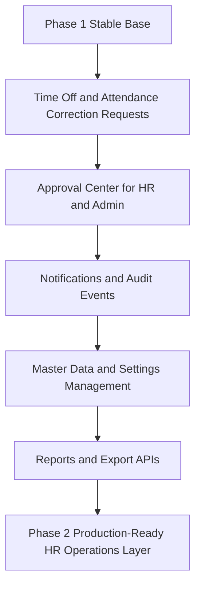
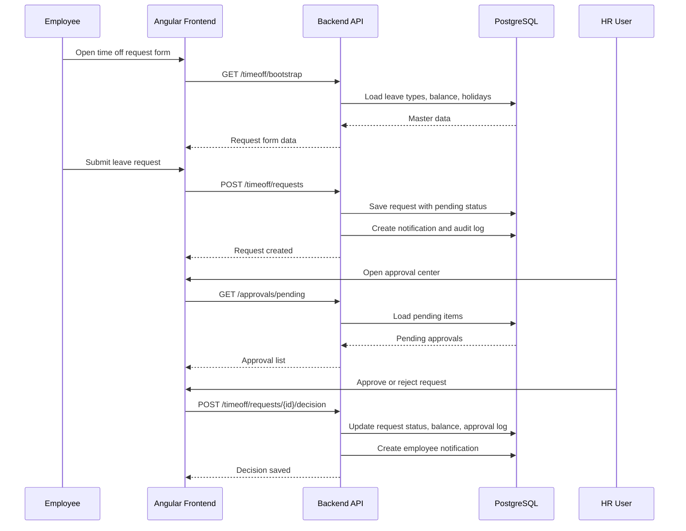
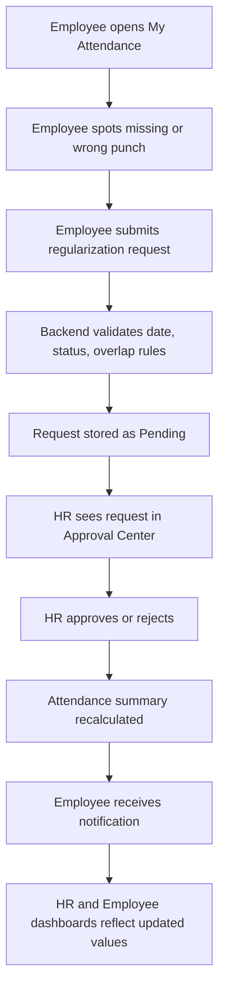

# Phase 2 Master Implementation Document

## 1. What This Document Is For

This is the **master Phase 2 implementation document** for the Aivan HRMS Portal.

Phase 1 established the shared portal foundation:

- single login
- admin, HR, and employee roles
- attendance dashboard flows
- employee creation and access creation
- basic profile and password flows

Phase 2 should now focus on making the portal **operationally complete**, not just demo-ready.

This document is the overview file for:

- Phase 2 product scope
- role responsibilities
- module hierarchy
- implementation order
- frontend and backend split

Detailed implementation files:

- [phase2 frontend.md](/Users/vivekmehta/Development/Vivek/AIVan/Aivan-HRMS-Portal/phase2-documents/phase2%20frontend.md)
- [phase2 backend.md](/Users/vivekmehta/Development/Vivek/AIVan/Aivan-HRMS-Portal/phase2-documents/phase2%20backend.md)

These 3 files together are the Phase 2 source of truth.

---

## 2. Phase 2 Goal

Phase 2 should convert the current system from a basic attendance portal into a more complete HRMS operations platform.

The main target is:

- finish partially implemented modules already present in code
- remove ambiguity between mock-ready and production-ready flows
- add approval-based HR operations
- move more logic cleanly to backend
- introduce master data and workflow management needed for real business use

---

## 3. Phase 2 Entry Condition

Phase 2 should begin only after **Phase 1 correction and cleanup work** is stable.

That means these Phase 1 items should be reliable first:

- login and role redirect
- admin HR management
- HR employee management
- employee dashboard and punch flow
- attendance list and summaries
- profile and password flows
- frontend-backend contract cleanup

Phase 2 is not a replacement for unfinished Phase 1 work.

It is the next structured layer on top of a corrected Phase 1 baseline.

---

## 4. Phase 2 Recommended Scope

### In Scope

1. `Time Off / Leave Management`
   - employee leave request
   - HR/admin approval or rejection
   - leave balance handling
   - leave history and status tracking

2. `Approval Center`
   - pending approvals list
   - approval history
   - action comments
   - approval audit trail

3. `Notifications`
   - in-app notification feed
   - approval notifications
   - punch notifications
   - login activity notifications

4. `Login Activity and Security`
   - login history list
   - suspicious login review
   - forgot/reset password stabilization
   - session-aware security notes

5. `Master Data Management`
   - departments
   - designations
   - shifts
   - work locations
   - leave types
   - holiday calendar

6. `Attendance Regularization`
   - employee request for missing or incorrect attendance
   - HR review and approval
   - adjustment audit trail

7. `Reports and Exports`
   - employee attendance report
   - time off report
   - exception report
   - CSV export

8. `Admin Control Layer`
   - better role visibility
   - active/inactive control
   - reset user access
   - user overview across roles

### Out Of Scope For Phase 2

- payroll calculations
- salary slips
- reimbursement accounting
- recruitment ATS
- appraisal cycle
- asset management
- mobile app APIs
- multi-tenant company setup

---

## 5. Why This Scope Makes Sense

The current repo already shows signs of these modules:

- time off backend exists but is not fully activated
- notifications are present
- login activity already exists
- forgot/reset password exists
- HR and employee dashboards already expose data patterns that can support approval-based modules

So Phase 2 should not introduce random new features first.

It should finish the **natural next modules** already hinted at by the current implementation.

---

## 6. Final Role Flow In Phase 2

### Admin

Admin remains the top operational controller.

Admin can:

- create and manage HR accounts
- see HR list
- see employee list
- review overall attendance health
- monitor login activity if required
- manage master data
- optionally act as escalation approver

### HR

HR becomes the main daily operations role.

HR can:

- manage employees
- monitor attendance history
- review missed punch or regularization requests
- approve or reject time off requests
- review notifications
- use master data in day-to-day forms

### Employee

Employee remains self-service focused.

Employee can:

- view dashboard
- punch in and punch out
- view attendance history
- request time off
- request attendance correction
- view request status
- view notifications
- manage own profile and password

---

## 7. Phase 2 Module Hierarchy

```text
Phase 2
├── Foundation Stabilization
│   ├── API contract cleanup
│   ├── route and screen consistency
│   ├── backend pagination/filtering
│   └── audit-safe DB flows
├── Employee Self Service Expansion
│   ├── time off request
│   ├── attendance regularization
│   ├── notification center
│   └── login activity visibility
├── HR Operations Expansion
│   ├── approval center
│   ├── leave review
│   ├── attendance correction review
│   ├── employee status management
│   └── reports
├── Admin Control Expansion
│   ├── master data management
│   ├── role access oversight
│   ├── user access reset
│   └── audit dashboards
└── Reporting Layer
    ├── attendance exports
    ├── leave exports
    └── exception summaries
```

---

## 8. Suggested Phase 2 Build Order

Build Phase 2 in this order:

1. stabilize current backend contracts
2. activate and complete time off module
3. add approval center
4. add attendance regularization
5. complete notifications and login activity UX
6. build master data management pages
7. add export/report endpoints
8. clean up dashboard summaries using real backend aggregates

This order is important because:

- time off and regularization depend on employee and attendance data
- approval center depends on those request workflows
- reports become easier after workflows are stable

---

## 9. High-Level Flow Diagram



---

## 10. Time Off Flow Diagram



---

## 11. Attendance Regularization Flow Diagram



---

## 12. Frontend vs Backend Ownership

### Frontend Should Own

- screen rendering
- form validation for UX
- route protection
- user interaction flow
- table filters and inputs
- request state display
- optimistic loading states

### Backend Should Own

- final validation
- role authorization
- business rules
- data filtering and pagination
- summary calculations
- approval state changes
- audit logs
- exports

---

## 13. Phase 2 Deliverables

By the end of Phase 2, the product should have:

- working time off request lifecycle
- working attendance regularization lifecycle
- notification center fully connected
- login activity screens fully useful
- master data CRUD for operational dropdowns
- approval center for HR/admin
- report/export endpoints
- frontend screens fully connected to backend APIs

---

## 14. Developer Split

### If One Developer Is Handling Both

Recommended order:

1. backend schema and migrations
2. backend APIs
3. backend seed data
4. frontend services
5. frontend screens
6. testing and cleanup

### If Split Across Frontend and Backend

Frontend developer:

- build UI pages and route map
- integrate API services
- handle state and error UX

Backend developer:

- define DB schema
- create workflow APIs
- enforce approval logic
- provide pagination, filters, and aggregates

---

## 15. Documents To Use Next

Use these next:

- [phase2 frontend.md](/Users/vivekmehta/Development/Vivek/AIVan/Aivan-HRMS-Portal/phase2-documents/phase2%20frontend.md)
- [phase2 backend.md](/Users/vivekmehta/Development/Vivek/AIVan/Aivan-HRMS-Portal/phase2-documents/phase2%20backend.md)

The frontend file explains screens, routes, services, and UI implementation order.

The backend file explains schema, API contracts, module design, and step-by-step backend implementation.

---

## 16. Important Clarification About This Phase 2 Set

Yes, this Phase 2 set is prepared by keeping the **current repo progress** in mind.

It is based on the fact that the codebase already has:

- admin, HR, and employee role flow
- attendance APIs and screens
- employee management screens
- notification plumbing
- login activity screens
- forgot/reset password flow
- partial time off code

That is why Phase 2 is written as:

- complete what is partially present
- stabilize what is inconsistent
- add the next operational layer

It is **not** written as if the project is starting from zero.

---

## 17. How Detailed These Documents Are

Current Phase 2 documents now cover:

- module scope
- role hierarchy
- screen list
- route map
- backend schema direction
- endpoint list
- request and response examples
- implementation order

But for a fresher developer, the most important thing is that there should be **very little guessing**.

So the detailed frontend and backend documents should always explicitly mention:

- exact field names
- field types
- enum values
- required vs optional fields
- list response shape
- object nesting
- validation rules
- error response format
- service and component ownership

The updated Phase 2 frontend and backend files now include this next level of detailing.
